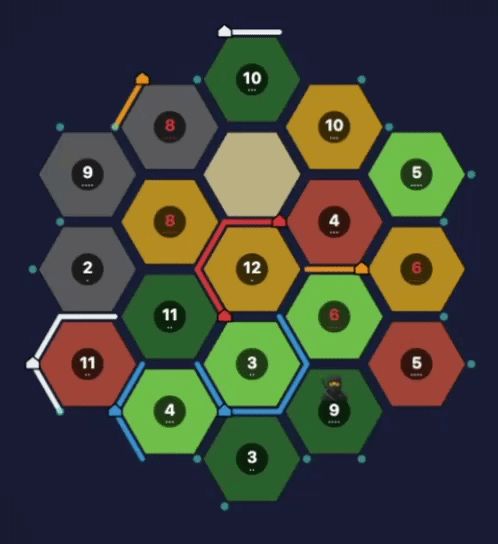

<div align="center">

# Catan Sim

**A complete Settlers of Catan engine with self-play reinforcement learning, a playable web UI, and tools for analysing AI strategy.**

[](https://www.python.org/downloads/)
[](LICENSE)
[](#testing)



*Live spectator view — watch four AI agents learn Catan in real-time*

</div>

---

## Highlights

| | Feature | Details |
|---|---|---|
| 🎲 | **Full Game Engine** | All standard Catan rules — resource production, building, trading (4:1 / 3:1 / 2:1 harbors), dev cards, robber, longest road, largest army |
| 🧠 | **PPO Self-Play AI** | 1.5 M-parameter actor-critic network trained via Proximal Policy Optimization across 4-player self-play |
| 🌐 | **Web UI** | React + TypeScript frontend — play against trained bots at Easy / Medium / Hard / Random difficulty |
| 🔴 | **Live Spectator** | Watch AI training games in real-time with adjustable playback speed |
| 📼 | **Game Replays** | Won games are automatically recorded; step through them frame-by-frame to study winning strategies |
| 📊 | **Strategy Analysis** | Compare checkpoints across training to see how settlement patterns, trading habits, and build orders evolve |
| 📈 | **TensorBoard** | Policy loss, value loss, entropy, reward curves, and per-epoch win stats |

## Architecture

```
catan/            Game engine — board generation, rules, state machine
  ├── board.py        Hex grid, vertices, edges, harbors
  ├── game.py         Actions, legal-move generation, state transitions
  ├── constants.py    Enums, terrain/resource maps
  └── replay.py       Game recording & frame-by-frame playback

ai/               Reinforcement learning
  ├── network.py      Actor-critic neural network (1328 → 481 actions)
  ├── agent.py        PPO agent with action masking
  ├── trainer.py      Self-play training loop with replay recording
  ├── features.py     State → feature vector encoding
  └── strategies.py   Post-hoc strategy analysis & checkpoint comparison

server/           Web backend
  └── app.py          FastAPI + WebSocket (game sessions, spectator, replays)

web/              Frontend (React 19 + TypeScript + Vite)
  └── src/
      ├── App.tsx             Main app with difficulty select
      ├── BoardView.tsx       Interactive hex board with harbors
      ├── SpectatorView.tsx   Live training viewer
      ├── ReplayViewer.tsx    Frame-by-frame replay browser
      └── TrainingDashboard.tsx  Epoch charts

scripts/          CLI tools
  ├── train.py        Launch training
  ├── serve.py        Start web server
  ├── play_cli.py     Terminal-based game
  └── analyze.py      Strategy analysis & checkpoint comparison
```

## Quick Start

### 1. Install

```bash
git clone https://github.com/edtireli/catan-sim.git
cd catan-sim

python -m venv .venv && source .venv/bin/activate
pip install -e ".[dev]"

cd web && npm install && cd ..
```

### 2. Train the AI

```bash
python scripts/train.py --epochs 200 --games-per-epoch 50
```

Checkpoints are saved to `checkpoints/` and replays of won games to `replays/`.

Monitor training metrics:

```bash
tensorboard --logdir runs/
```

### 3. Play

```bash
python scripts/serve.py          # serves on http://localhost:8000
```

Open the browser and pick a difficulty — you'll play as Player 0 against three AI agents.

### 4. Watch AI Train (Live)

From the start screen click **🔴 Live Spectator**, choose a training length, and watch games unfold in real-time with speed controls (Max / Normal / Slow / Pause).

### 5. Analyse Replays

From the start screen click **📼 Replays** to browse won games. Use the frame slider and ⏮ ◀ ▶ ⏭ controls to step through every action, inspect each player's resources, and watch VP progression.

Or from the CLI:

```bash
python scripts/analyze.py --checkpoint checkpoints/epoch_200.pt --games 100
python scripts/analyze.py --compare --games 50   # compare all checkpoints
```

## Game Rules

All standard Settlers of Catan rules are implemented:

- **Board** — Randomised hex grid with 19 tiles, 54 vertices, 72 edges, 9 harbors
- **Resources** — Brick, Lumber, Ore, Grain, Wool; produced on dice rolls matching tile numbers
- **Building** — Roads (B+L), Settlements (B+L+G+W), Cities (3O+2G)
- **Dev Cards** — Knight, Victory Point, Road Building, Year of Plenty, Monopoly
- **Trading** — 4:1 with the bank, 3:1 at generic ports, 2:1 at resource-specific harbors
- **Robber** — Activated on a roll of 7; players with >7 cards discard half; robber is moved and a resource is stolen
- **Bonuses** — Longest Road (5+ connected roads, 2 VP), Largest Army (3+ knights, 2 VP)
- **Victory** — First player to reach 10 VP wins

## AI Details

The AI uses **Proximal Policy Optimization (PPO)** with full self-play:

| Component | Specification |
|---|---|
| **Network** | Shared-trunk MLP — 1328-dim state → 512 → 256 → policy head (481 actions) + value head |
| **Parameters** | ~1.5 M |
| **State features** | Board topology, per-vertex/edge ownership, resource counts, dev cards, harbors, game phase, dice |
| **Action masking** | Only legal actions receive probability mass; illegal actions are zeroed before softmax |
| **Training** | 4 agents share one network; each game produces experiences from all players |
| **Reward** | +1.0 for winning, −0.33 for losing, 0.0 for timeout/draw |
| **Optimiser** | Adam, lr = 3×10⁻⁴, γ = 0.99, λ_GAE = 0.95, clip ε = 0.2 |

## Testing

```bash
pytest tests/                     # 16 tests — engine, AI, features, replay
python scripts/play_cli.py        # quick CLI smoke test
```

## License

MIT
